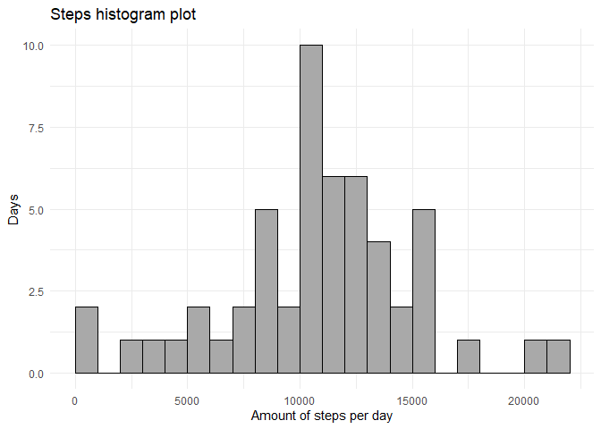

## Loading libraries

We will need ggplot2 and data.table libraries, let's go load them:


```r
library(data.table)
<<<<<<< HEAD
library(ggplot2)
```

=======
```

```
## Warning: package 'data.table' was built under R version 3.6.1
```

```r
library(ggplot2)
```

```
## Warning: package 'ggplot2' was built under R version 3.6.1
```

>>>>>>> d61fc56cef49446d45cc93a84bd69133a292804d

## Loading and preprocessing the data


```r
if (!file.exists("./data/activity.csv")){
      unzip("activity.zip", exdir = "./data")
} else {
      print("There's no need to unzip!")
}
```

```
## [1] "There's no need to unzip!"
```

```r
active_data <- as.data.table(read.csv("./data/activity.csv", header = T))
active_data$date <- as.Date(as.character(active_data$date))
```


## What is mean total number of steps taken per day?

Now i'm going to calculate the total amount of steps taken per day.  
I will notice that activity data set contains some missing values, so i prefer not to remove them
because i think it's more accurate instead of counting them as zeros.
Here i create new dataset based on active_data where i will have 2 columns, for total amount of steps taken per day and corresponding date. 


```r
steps_per_day = active_data[, list(steps = sum(steps, na.rm = F)), by = date]
```

<<<<<<< HEAD
Now let's check out the histogram of total number of steps...
=======
Now let's check out the histogram Of total number of steps. 
>>>>>>> d61fc56cef49446d45cc93a84bd69133a292804d


```r
plot = ggplot(data = steps_per_day, aes(x=steps))+
       geom_histogram(breaks=seq(0, 22000, by = 1000), 
                      color="Black", fill="darkgrey") + 
       labs(title="Steps histogram plot",
           x="Amount of steps per day", y="Days") +
       theme_minimal()

print(plot)
```

```
## Warning: Removed 8 rows containing non-finite values (stat_bin).
```

<!-- -->

<<<<<<< HEAD
... and calculate mean and median number of steps for this dataset.


```r
steps_mean = round(mean(steps_per_day$steps, na.rm = T), 0)
steps_median = median(steps_per_day$steps, na.rm = T)
```

As wee can see, the mean value is 1.0766\times 10^{4} and the median is 10765.

=======
>>>>>>> d61fc56cef49446d45cc93a84bd69133a292804d
## What is the average daily activity pattern?


## Imputing missing values


## Are there differences in activity patterns between weekdays and weekends?
